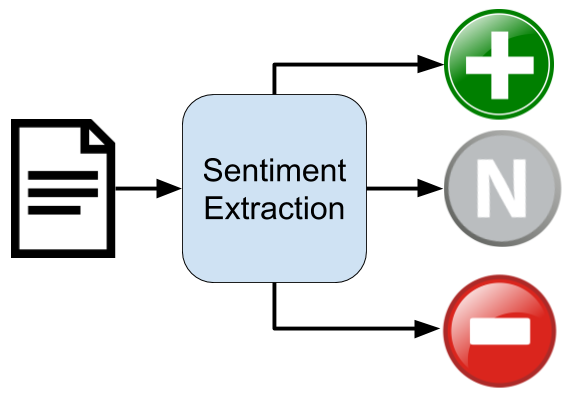
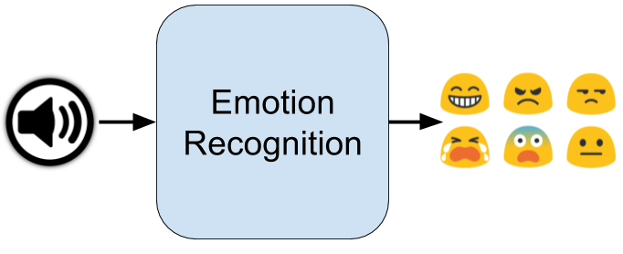
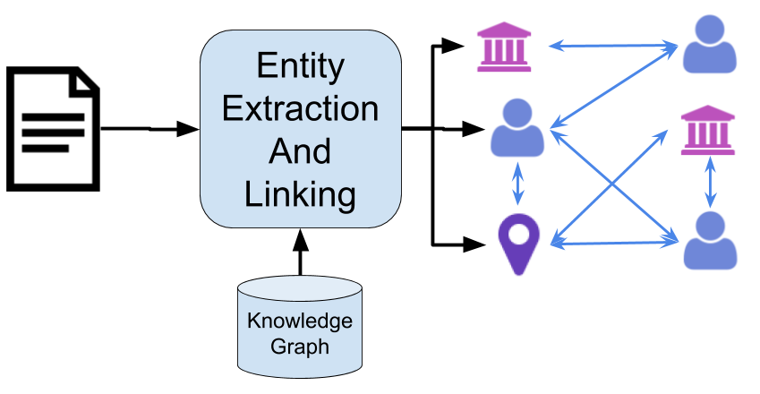

# MixedEmotions

The MixedEmotions platform is a Big Data Toolbox for multilingual and multimodal emotion analysis. It is built around stand alone docker modules with an orchestrator that links the modules into analysis workflows utilising MESOS for scalable cloud deployment. Core capabilities include emotion extraction from text, audio and video with many other capabilities, such as sentiment analysis, social network analysis, entity detection and linking and sophisticated data visualisation.

## Contact

info@mixedemotions-project.eu

## Modules

The MixedEmotions platform has been developed with several modules in it. Those modules provide diverse functionalities. Mainly, the toolbox is focused on extracting emoitions from different modalities: text, audio and video. However it also provides other kind of functionalities such as Social Network analysis, Knowledge graphs, entity linking and many others.

Some functionalities are provided with open source modules. Others are provided with proprietary modules.

The list of modules can be found in these tables below, with links pointing to resources where you can have more information about them.

### Open Source Modules

|Id|Functionality|Modality|Language|Source|Download|
|---|---|---|---|---|---|
|m1|Sentiment Extraction |Text|EN|[github]| [Dockerhub]|
|m2|Sentiment Extraction |Text|EN, CS|[github](https://github.com/MixedEmotions/but_sentiment)|[Dockerhub]|
|m4|Sentiment Extraction |Text|EN, ES|[github](https://github.com/MixedEmotions/senpy)|[Dockerhub](https://hub.docker.com/r/mixedemotions/senpy/)|
|m5|Emotion recognition |Text|EN|[github]|[Dockerhub](https://hub.docker.com/r/mixedemotions/05_emotion_hashtags_nuig/)
|m6|Emotion recognition |Audio|EN|[github](https://github.com/MixedEmotions/up_emotions_audio)|[Dockerhub]
|m7|Emotion recognition |Text|EN, ES, Multiple|[github](https://github.com/MixedEmotions/senpy)|[Dockerhub](https://hub.docker.com/r/mixedemotions/senpy/)|
|m8|Entity Extraction |Text|ES|[github](https://github.com/MixedEmotions/08_entity_extraction_es)|[Dockerhub](https://hub.docker.com/r/mixedemotions/08_entity_extraction_pt/) |
|m10|Entity Extraction and Linking |Text|EN|[github]|[Dockerhub](https://hub.docker.com/r/mixedemotions/10_entity_linking_nuig/) |
|m13|Topic Extraction |Text|ES|[github](https://github.com/MixedEmotions/13_topic_extraction)|[Dockerhub](https://hub.docker.com/r/mixedemotions/13_topic_extraction_spanish/) |
|m16|Suggestion mining |Text|EN|[github](https://github.com/MixedEmotions/NUIG-suggestion)|[Dockerhub](https://hub.docker.com/r/sapnanegi/16_suggestion_mining_nuig/) |
|m20|Twitter media crawler |Text|n/a|[github](https://github.com/MixedEmotions/twitter_crawlers)|n/a |
|m21|Fusion |Text/Audio/Video|n/a|[github]|[Dockerhub] |
|m22|Social Network Analysis |graph|n/a|[github](https://github.com/MixedEmotions/scaner)|[Dockerhub](https://hub.docker.com/r/mixedemotions/scaner/) |
|m25|Social semantic Knowledge graph |graph|n/a|[github]|[Dockerhub] |
|m27|Emotion recognition from Video  |Video|n/a|BUT|[+info](https://github.com/MixedEmotions/MixedEmotions/wiki/m27.-Video-Emotion-recognition-by-BUT)|
|m28|Analytics module “Kibi”|-|-|[github](https://github.com/MixedEmotions/kibi)|[kibi](https://siren.solutions/kibi/) |
|m32|Youtube crawler |Text/Video|n/a|[github](https://github.com/MixedEmotions/youtube_downloader)|n/a|

### Proprietary Modules

|Id|Functionality|Modality|Language|Proprietary|More info|
|---|---|---|---|---|---|
|m3|Sentiment Extraction |Text|EN, IT|ExpertSystem|[+info](https://github.com/MixedEmotions/MixedEmotions/wiki/m3-Sentiment-Extraction-by-ExpertSystem)|
|m9|Entity Extraction |Text|IT, EN|ExpertSystem|[+info](https://github.com/MixedEmotions/MixedEmotions/wiki/m9.-Italian-and-English-Entity-Extraction-by-ExpertSystem)|
|m11|Topic Extraction |Text|IT, EN|ExpertSystem|[+info](https://github.com/MixedEmotions/MixedEmotions/wiki/m11.-Italian-and-English-Topic-Extraction-by-ExpertSystem)|
|m12|Topic Extraction |Text|EN|NUIG|[+info](https://github.com/MixedEmotions/MixedEmotions/wiki/m12.-External-English-Topic-Extraction-by-NUIG)|
|m15|Entity Linking |Text|IT, EN|ExpertSystem|[+info](https://github.com/MixedEmotions/MixedEmotions/wiki/m15.-External-Italian-and-English-Entity-Linking-by-ExpertSystem)|
|m17|Speech to text |Audio|EN|Phonexia|[+info](https://github.com/MixedEmotions/MixedEmotions/wiki/m17.-Speech-to-text-by-Phonexia)|
|m18|Machine translation |Text|CS, ES, DE, IT|NUIG|[+info](https://github.com/MixedEmotions/MixedEmotions/wiki/m18.-Machine-translation-by-NUIG)|
|m23|Emotion recognition from Audio |Audio|DE, EN, CS|Phonexia|[+info](https://github.com/MixedEmotions/MixedEmotions/wiki/m23.-Audio-Emotion-extraction-by-Phonexia)|
|m24|Recommendation engine|Text|EN|ExpertSystem|[+info](https://github.com/MixedEmotions/MixedEmotions/wiki/m24.-Recommendation-engine-by-ExpertSystem)|
|m28|Age estimation from audio |Audio|n/a|Phonexia|[+info](https://github.com/MixedEmotions/MixedEmotions/wiki/m28.-Age-estimation-from-audio-by-Phonexia)|
|m29|Gender identification from audio |Audio|n/a|Phonexia|[+info](https://github.com/MixedEmotions/MixedEmotions/wiki/m29.-Gender-identification-from-audio-by-Phonexia)|

### Custom Module
You can use your REST service or your own Docker module within the platform. For how to use a Docker module within the platform check the [wiki](https://github.com/MixedEmotions/MixedEmotions/wiki/Using-your-own-Docker-Module)

### Orchestrator

Additionally an open source orchestrator has been developed as an starting point on using the MixedEmotions Toolbox. You can find it [here](https://github.com/MixedEmotions/orchestrator).

## More information

More information about the platform can be found on this project's [wiki page](https://github.com/MixedEmotions/MixedEmotions/wiki).

## Partners

| Partner | Country|
|---|---|
|NATIONAL UNIVERSITY OF IRELAND, GALWAY| Ireland |
|UNIVERSIDAD POLITECNICA DE MADRID|Spain |
|UNIVERSITAT PASSAU | Germany |
|EXPERT SYSTEM S.P.A. | Italy |
|PARADIGMA DIGITAL SL | Spain |
| VYSOKE UCENI TECHNICKE V BRNE |Czech Republic|
| SINDICE LIMITED | Ireland |
| DEUTSCHE WELLE | Germany |
| PHONEXIA SRO |Czech Republic|

## Acknowledgement

This development has been  funded by the European Union through the MixedEmotions Project (project number H2020 655632), as part of the `RIA ICT 15 Big data and Open Data Innovation and take-up` programme.

 

 http://ec.europa.eu/research/participants/portal/desktop/en/opportunities/index.html
